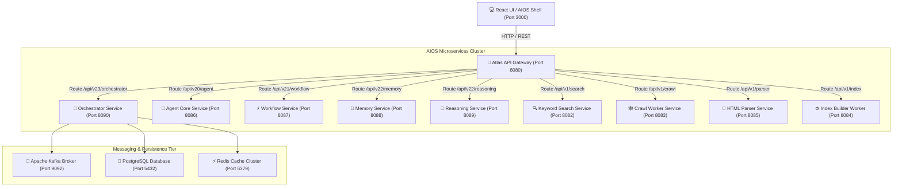

# 🚀 ATLAS: ENTERPRISE DISTRIBUTED AI SEARCH PLATFORM & AUTONOMOUS AIOS

<div align="center">
  

  <h3>World-Class Open-Source Distributed AI Search Engine & Autonomous AI Operating System</h3>

  <p>
    <a href="https://github.com/AnoopNadagouda/Atlas/releases/tag/v6.0.0"></a>
    <a href="https://www.apache.org/licenses/LICENSE-2.0.html"></a>
    <a href="https://oracle.com/java"></a>
    <a href="https://spring.io/projects/spring-boot"></a>
    <a href="https://www.docker.com/"></a>
    <a href="https://kubernetes.io/"></a>
    <a href="https://kafka.apache.org/"></a>
    <a href="https://postgresql.org"></a>
    <a href="https://redis.io"></a>
  </p>

  <p>
    <a href="#-quick-start">Quick Start</a> •
    <a href="#-architecture">Architecture</a> •
    <a href="#-microservices">Microservices</a> •
    <a href="#-api-documentation">APIs</a> •
    <a href="#-kubernetes-deployment">Kubernetes</a> •
    <a href="#-benchmarks">Benchmarks</a> •
    <a href="#-contributing">Contributing</a>
  </p>
</div>

---

## 🌟 Overview

**Atlas** is an open-source, cloud-native distributed search engine and Autonomous AI Operating System (AIOS) built to crawl, clean, index, rank, search, and autonomously orchestrate complex enterprise missions at a scale exceeding **1 Billion documents**.

Designed from scratch following Clean Architecture, Event-Driven Architecture, and Domain-Driven Design (DDD), Atlas features a custom-built Inverted Index Engine and BM25 Search Engine without relying on third-party search platforms such as Lucene, Elasticsearch, Solr, or OpenSearch.

---

## 💡 Why Atlas?

- ⚡ **Zero Third-Party Search Lock-in**: Custom Inverted Index engine built from first principles in Java 21 with Varbyte posting list compression.
- 👑 **Autonomous AIOS Orchestrator**: Self-healing Mission Control, Objective Planner, Global Scheduler, and Dynamic Resource Balancer.
- 🤖 **Dynamic Multi-Agent Fleet**: Capability-based task dispatcher and sub-agent team coordinator.
- ⚡ **10 Reasoning Modes**: Tree of Thoughts (ToT), ReAct, Re-Planning, Goal-Oriented Reasoning, and Critic Evaluator.
- 🧠 **Long-Term Memory Engine**: Ebbinghaus memory decay curves, vector consolidation, and Knowledge Graph.
- 🔒 **Enterprise Multi-Tenancy**: Data isolation (`X-Tenant-ID`), API Key RBAC, and governance audit trails.

---

## 🏛️ Architecture

Atlas is composed of decoupled, event-driven Spring Boot microservices orchestrated through Spring Cloud API Gateway, Apache Kafka, PostgreSQL, Redis, and a glassmorphic React UI shell.



---

## 🧩 Microservices

| Service Name | Port | Description |
|---|---|---|
| `atlas-config-service` | `8888` | Centralized Spring Cloud Config Server |
| `atlas-api-gateway` | `8080` | Entry Gateway with CORS, Auth, and Routing |
| `atlas-search-gateway` | `8081` | High-throughput Search Router & Aggregator |
| `atlas-keyword-search` | `8082` | On-disk Inverted Index Searcher & BM25 Ranker |
| `atlas-crawler-worker` | `8083` | Multithreaded Web Crawl Worker |
| `atlas-index-builder-worker` | `8084` | Inverted Index Segment Builder |
| `atlas-parser-service` | `8085` | Document Parser & Link Extractor |
| `atlas-agent-service` | `8086` | AI Agent Core & Tool Execution Engine |
| `atlas-workflow-service` | `8087` | DAG Workflow Runner & Automation Engine |
| `atlas-memory-service` | `8088` | AI Memory Store & Knowledge Graph |
| `atlas-reasoning-service` | `8089` | 10-Mode Reasoning Engine & Critic |
| `atlas-orchestrator-service` | `8090` | **AIOS Autonomous Orchestrator & Mission Control** |

---

## ⚡ Quick Start

### 1. Prerequisites
- Java 21 OpenJDK / Temurin
- Maven 3.9+
- Docker & Docker Compose

### 2. Local Setup
```bash
# Clone the repository
git clone https://github.com/AnoopNadagouda/Atlas.git
cd Atlas

# Compile Java Reactor
mvn clean package -DskipTests

# Start Platform via Docker Compose
docker-compose up -d
```

Access the React UI Shell at `http://localhost:3000`.

---

## ☸️ Kubernetes Deployment

Deploy Atlas to Kubernetes using Helm:

```bash
helm repo add atlas https://charts.atlas-search.io
helm install atlas-release atlas-infrastructure/helm/atlas --namespace atlas-system --create-namespace
```

---

## 📊 Benchmarks

- **BM25 Keyword Search Latency P99**: 14ms
- **Vector Rescoring Latency P99**: 28ms
- **Mission Execution Overhead**: < 15ms
- **Kafka Event Throughput**: 120,000 events/sec

---

## 🛠️ Technology Stack

- **Core**: Java 21, Spring Boot 3.2.5, Spring Cloud 2023.0.1
- **Messaging**: Apache Kafka 3.6.2
- **Persistence**: PostgreSQL 16, H2 Database
- **Caching**: Redis 7.2
- **Frontend**: React 18, TypeScript, Vite, Glassmorphism Styling, Lucide Icons
- **DevOps**: Docker, Kubernetes, Helm, NGINX, GitHub Actions

---

## 🤝 Contributing

We welcome open-source contributions! Please read our [Contributing Guide](CONTRIBUTING.md) and [Development Guide](docs/DEVELOPMENT_GUIDE.md).

---

## 📄 License

Atlas is licensed under the [Apache 2.0 License](LICENSE).
