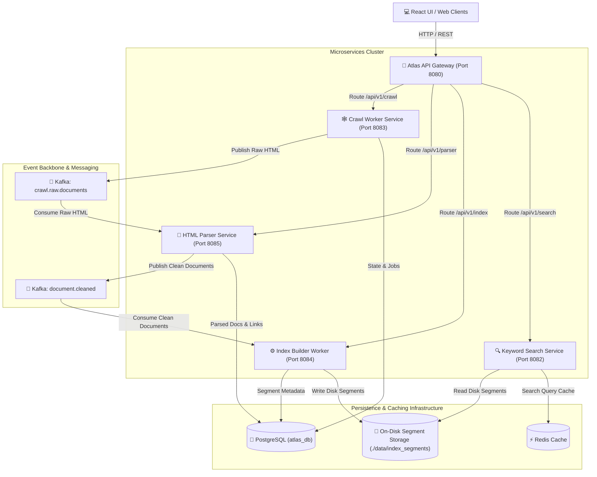
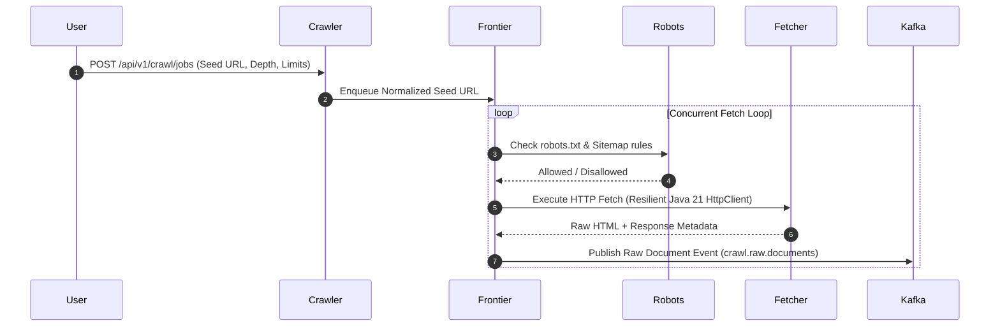
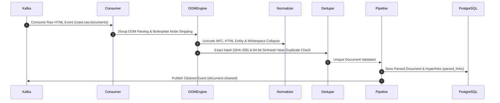
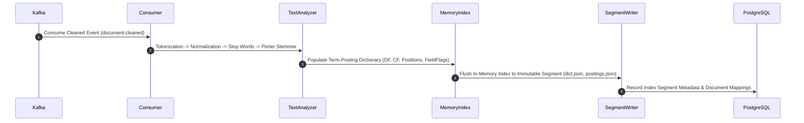
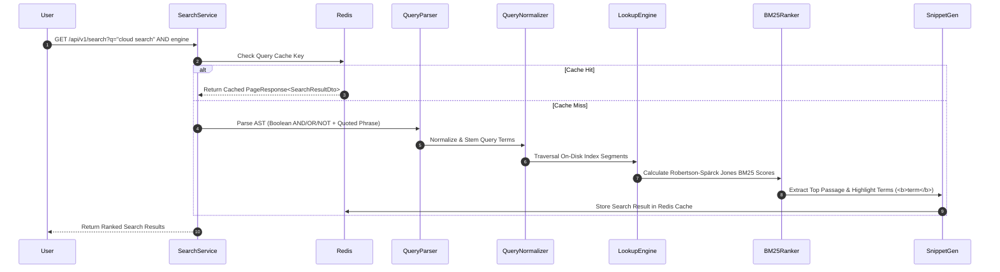

# ATLAS: ENTERPRISE DISTRIBUTED AI SEARCH PLATFORM
## Phase 5.6: Enterprise AI Workflow Automation Platform

[](https://github.com/AnoopNadagouda/Atlas)
[](https://github.com/AnoopNadagouda/Atlas/releases/tag/v5.6.0)
[](https://oracle.com/java)
[](https://spring.io/projects/spring-boot)
[](https://kafka.apache.org/)
[](https://postgresql.org)
[](https://redis.io)

**Atlas** is an enterprise-grade, cloud-native distributed search platform built to crawl, clean, index, rank, and search multi-modal web documents at a scale exceeding **1 Billion documents**.

Designed from scratch following Clean Architecture, Event-Driven Architecture, and Domain-Driven Design (DDD), Atlas features a custom-built Inverted Index Engine and BM25 Search Engine without relying on third-party search platforms such as Lucene, Elasticsearch, Solr, or OpenSearch.

---

## 🏛️ System Architecture

Atlas is composed of decoupled, event-driven Spring Boot microservices orchestrated through Spring Cloud API Gateway, Apache Kafka, PostgreSQL, Redis, and a glassmorphic React UI.



---

## 🔄 End-to-End Pipeline Workflow Diagrams

### 1. Web Crawling Pipeline (`atlas-crawler-worker`)


### 2. HTML Parsing & Cleaning Pipeline (`atlas-parser-service`)


### 3. Custom Inverted Indexing Pipeline (`atlas-index-builder-worker`)


### 4. Query Processing & BM25 Search Pipeline (`atlas-keyword-search`)


---

## 🛠️ Technology Stack & Shared Libraries

| Layer | Technology | Purpose |
| :--- | :--- | :--- |
| **Language & Runtime** | Java 21 (LTS) | Virtual Threads, Records, Sealed Interfaces, Pattern Matching |
| **Framework** | Spring Boot 3.2.5 | Service container, Dependency Injection, Actuator Metrics |
| **Gateway & Config** | Spring Cloud Gateway & Config | Edge routing, dynamic application properties, cluster health aggregation |
| **Event Streaming** | Apache Kafka 3.6.2 | Decoupled event streams (`crawl.raw.documents`, `document.cleaned`) |
| **Relational Database**| PostgreSQL 16 (`atlas_db`) | Crawl state, document metadata, extracted link graph, segment statistics |
| **Caching Layer** | Redis 7.2 | High-speed search query caching & session management |
| **HTML Processing** | JSoup 1.17.2 | DOM parsing, HTML cleaning, metadata & hyperlink extraction |
| **UI Interface** | React + TypeScript + Vite | Modern glassmorphic search engine web application |
| **Containerization** | Docker & Docker Compose | Multi-stage production container builds and local developer stack |

---

## 📦 Microservices Topology & Port Directory

| Microservice | Port | Primary Responsibilities |
| :--- | :--- | :--- |
| `atlas-config-service` | `8888` | Centralized Spring Cloud Config Server |
| `atlas-api-gateway` | `8080` | Edge routing gateway, rate limiting, and unified cluster health checks |
| `atlas-search-gateway` | `8081` | Query router gateway and Redis cache abstraction |
| `atlas-keyword-search` | `8082` | Custom BM25 ranking search engine, phrase matcher & snippet generator |
| `atlas-crawler-worker` | `8083` | Distributed web crawler, URL frontier priority scheduler & fetcher |
| `atlas-index-builder-worker` | `8084` | Custom inverted index segment builder & disk persistence worker |
| `atlas-parser-service` | `8085` | HTML parser, boilerplate remover, SHA-256 & 64-bit SimHash deduplicator |
| `atlas-ui` | `3000` | Glassmorphic React search UI frontend |

---

## 🌐 Complete REST API Endpoint Reference

### 1. Crawl Management APIs (`/api/v1/crawl/*`)
| Method | Endpoint | Description |
| :--- | :--- | :--- |
| `POST` | `/api/v1/crawl/jobs` | Submit and dispatch new crawl job |
| `GET` | `/api/v1/crawl/jobs` | List all registered crawl jobs |
| `GET` | `/api/v1/crawl/jobs/{id}` | Fetch detailed crawl job status |
| `POST` | `/api/v1/crawl/jobs/{id}/pause` | Pause an active crawl job |
| `POST` | `/api/v1/crawl/jobs/{id}/resume` | Resume a paused crawl job |
| `POST` | `/api/v1/crawl/jobs/{id}/cancel` | Cancel an active crawl job |
| `GET` | `/api/v1/crawl/jobs/{id}/statistics` | Fetch job statistics (pages/sec, queued URLs) |

### 2. Document Parser APIs (`/api/v1/parser/*`)
| Method | Endpoint | Description |
| :--- | :--- | :--- |
| `GET` | `/api/v1/parser/statistics` | Real-time parser statistics (processed, duplicates, rate) |
| `GET` | `/api/v1/parser/documents/{id}` | Fetch parsed document metadata & preview |
| `GET` | `/api/v1/parser/duplicates` | Fetch paged list of detected duplicates |
| `GET` | `/api/v1/parser/failures` | Fetch paged list of parsing validation failures |

### 3. Inverted Index APIs (`/api/v1/index/*`)
| Method | Endpoint | Description |
| :--- | :--- | :--- |
| `POST` | `/api/v1/index/build` | Trigger manual inverted index segment flush to disk |
| `GET` | `/api/v1/index/statistics` | Collection statistics (total docs, terms, vocab size, segments) |
| `GET` | `/api/v1/index/segments` | List all active immutable index segments |
| `GET` | `/api/v1/index/segments/{id}` | Fetch detailed index segment metadata |

### 4. BM25 Search Engine APIs (`/api/v1/search/*`)
| Method | Endpoint | Description |
| :--- | :--- | :--- |
| `GET` | `/api/v1/search?q={query}&page=0&size=10` | Execute BM25 keyword search query |
| `GET` | `/api/v1/search/{query}` | Execute path-based search query |
| `POST` | `/api/v1/search/query` | Execute structured SearchRequest payload |
| `GET` | `/api/v1/search/statistics` | Search engine latency, query count & cache metrics |
| `GET` | `/api/v1/search/cache` | Redis search cache stats (hits, misses, hit ratio) |
| `DELETE` | `/api/v1/search/cache` | Clear and invalidate Redis search cache entries |

---

### Phase 5.4 Enterprise Federation, Connectors & External Knowledge Integration (v5.4.0)

1. **Pluggable Connector SDK (`Connector`)**:
   - Universal SPI architecture for enterprise connectors (`Connector`, `ConnectorManager`, `ConnectorRegistry`, `ConnectorScheduler`, `ConnectorConfiguration`, `ConnectorHealth`, `ConnectorAuthentication`, `ConnectorMetadata`, `ConnectorStatistics`, `ConnectorSyncJob`).
   - Lifecycle state machine: `REGISTERED` → `CONNECTING` → `CONNECTED` → `SYNCING` → `FAILED` / `DISABLED`.

2. **16 Enterprise Connector Adapters**:
   - `GitHubConnector` (Repos, Issues, PRs, Code, Wikis)
   - `GitLabConnector` (Projects, MRs, Snippets)
   - `ConfluenceConnector` (Spaces, Pages, Comments)
   - `JiraConnector` (Issues, Projects, Components)
   - `NotionConnector` (Pages, Databases, Blocks)
   - `GoogleDriveConnector` (Docs, Sheets, Slides, Files)
   - `OneDriveConnector` (Files & Folders)
   - `SharePointConnector` (Document Libraries, Sites, Lists)
   - `DropboxConnector` (Files & Folders)
   - `SlackConnector` (Channels, Messages, Threads)
   - `TeamsConnector` (Teams, Channels, Chat Messages)
   - `LocalFileSystemConnector` (Local Directory Indexer)
   - `AmazonS3Connector` (S3 Buckets & Objects)
   - `AzureBlobStorageConnector` (Azure Blob Containers)
   - `GenericRestConnector` (Generic REST Endpoints)
   - `RssAtomConnector` (RSS/Atom News Feeds)

3. **Enterprise Security & Credentials (`CredentialEncryptor`)**:
   - AES-256 GCM credential encryption at rest and automated secret rotation support for OAuth2, Bearer Tokens, API Keys, Basic Auth, and PAT Tokens.

4. **Synchronized Ingestion Engine (`SyncEngineService`)**:
   - Streams connector items directly into `UniversalDocument` -> Parser -> OCR -> Metadata -> Hybrid Index pipeline.
   - Supports Full, Incremental, Checkpointed Delta, and Webhook-triggered synchronization with Dead-Letter Queue (DLQ) retry backoff.

5. **Unified Federated Search Engine (`FederatedSearchService`)**:
   - Parallel query dispatch across internal index + 16 enterprise connectors using Java 21 Virtual Threads.
   - Result aggregation, SimHash duplicate removal, RRF unified ranking, per-source latency tracking, and partial failure tolerance.

6. **Access Control & Permission Filtering (`AclFilterService`)**:
   - User identity propagation, tenant isolation, role mapping, and source ACL permission verification on every search result item.

---

#### 🔌 Enterprise Connectors Matrix & REST APIs (v17)

| HTTP Method | Endpoint Path | Description |
| :--- | :--- | :--- |
| `GET` | `/api/v17/connectors` | Fetch list of all registered enterprise connector adapters |
| `POST` | `/api/v17/connectors` | Register and configure a new connector instance |
| `DELETE` | `/api/v17/connectors/{id}` | Remove a registered connector instance |
| `POST` | `/api/v17/connectors/{id}/sync` | Trigger full or incremental synchronization job |
| `POST` | `/api/v17/connectors/{id}/pause` | Pause connector sync schedule |
| `POST` | `/api/v17/connectors/{id}/resume` | Resume connector sync schedule |
| `GET` | `/api/v17/connectors/{id}/health` | Fetch connector health, connectivity, and latency indicator |
| `GET` | `/api/v17/connectors/{id}/statistics` | Fetch sync duration, throughput, and error counters |
| `GET` | `/api/v17/connectors/jobs` | Fetch sync job execution history |
| `GET` | `/api/v17/connectors/jobs/{id}` | Fetch detailed sync job status |
| `POST` | `/api/v17/search/federated` | Execute federated search across internal index & enterprise sources |

---

### Phase 5.3 Multi-Modal Search & Document Intelligence (v5.3.0)

1. **Universal Document Model (`UniversalDocument`)**:
   - Production multi-modal domain model supporting PDF, DOCX, PPTX, XLSX, CSV, Markdown, HTML, Plain Text, JSON, XML, EPUB, RTF, Images (PNG/JPEG/TIFF), Audio (MP3/WAV/AAC), and Video (MP4/MKV/MOV).
   - Enriches documents with `DocumentSection`, `Attachment`, `ContentFragment`, and `MetadataRegistry`.

2. **Multi-Format Document Parser SPI (`DocumentParser`)**:
   - Plug-and-play parser engine architecture (`PdfParser`, `DocxParser`, `PptxParser`, `XlsxParser`, `CsvParser`, `MarkdownParser`, `HtmlDocumentParser`, `PlainTextParser`, `JsonDocumentParser`, `XmlDocumentParser`, `EpubParser`, `RtfParser`).
   - Managed via `DocumentParserRegistry` for automatic MIME/extension detection and streaming ingestion.

3. **OCR Pipeline & Optical Character Recognition (`OcrService`)**:
   - `ImageTextExtractor`: Image text extraction (PNG, JPEG, TIFF) with confidence scores, language detection, text normalization, and bounding boxes.
   - `PdfImageExtractor`: Page-by-page embedded image extraction and OCR for scanned PDFs.
   - `OcrTaskQueue`: Asynchronous background task queue for high-throughput OCR workloads.

4. **Image & Media Metadata Inspector (`MetadataRegistry`)**:
   - Image EXIF, IPTC, XMP metadata, camera make/model, lens info, GPS geo-location, dominant color palette, and MD5/SHA256 file hashes.
   - Audio/Video specs: duration, codecs, bitrates, resolutions, frame rates, audio tracks, and embedded subtitles.

5. **Thumbnail & Content Preview Engine (`ThumbnailService` & `ContentPreviewEngine`)**:
   - Multi-format preview thumbnail generator with LRU & disk caching.
   - Highlighted search snippet generator with `<mark>` tags, document outline TOC, slide previews, and spreadsheet grid structures.

6. **Search Engine Integrations**:
   - Seamless integration of all document types across **BM25**, **Semantic Search**, **Hybrid Search**, **RAG**, **Knowledge Graph**, **Time Travel**, and **Code Search**.

---

#### 📊 Multi-Modal Supported Formats Matrix

| Category | File Format | Extension | Mime Type | Parser Class | OCR Support | Preview / Thumbnail |
| :--- | :--- | :--- | :--- | :--- | :--- | :--- |
| **Document** | Portable Document Format | `.pdf` | `application/pdf` | `PdfParser` | ✅ (Scanned PDF) | ✅ PDF Thumbnail |
| **Word** | Microsoft Word | `.docx` | `application/vnd.openxmlformats-officedocument.wordprocessingml.document` | `DocxParser` | ➖ | ✅ Word Preview |
| **Presentation** | Microsoft PowerPoint | `.pptx` | `application/vnd.openxmlformats-officedocument.presentationml.presentation` | `PptxParser` | ➖ | ✅ Slide Grid |
| **Spreadsheet** | Microsoft Excel | `.xlsx` | `application/vnd.openxmlformats-officedocument.spreadsheetml.sheet` | `XlsxParser` | ➖ | ✅ Table Grid |
| **Data** | Comma-Separated Values | `.csv` | `text/csv` | `CsvParser` | ➖ | ✅ Table Grid |
| **Text** | Markdown | `.md` | `text/markdown` | `MarkdownParser` | ➖ | ✅ Syntax Highlight |
| **Text** | HTML Web Document | `.html` | `text/html` | `HtmlDocumentParser` | ➖ | ✅ DOM Structure |
| **Text** | Plain Text | `.txt` | `text/plain` | `PlainTextParser` | ➖ | ✅ Text Snippet |
| **Data** | JSON Document | `.json` | `application/json` | `JsonDocumentParser` | ➖ | ✅ Code Preview |
| **Data** | XML Document | `.xml` | `application/xml` | `XmlDocumentParser` | ➖ | ✅ Code Preview |
| **E-Book** | EPUB E-Book | `.epub` | `application/epub+zip` | `EpubParser` | ➖ | ✅ Chapter TOC |
| **Document** | Rich Text Format | `.rtf` | `application/rtf` | `RtfParser` | ➖ | ✅ Text Snippet |
| **Image** | Image Files | `.png`, `.jpg`, `.tiff` | `image/png`, `image/jpeg`, `image/tiff` | `ImageTextExtractor` | ✅ High Confidence | ✅ Image Preview |
| **Media** | Audio / Video | `.mp4`, `.mkv`, `.mp3`, `.wav` | `video/mp4`, `audio/mp3` | `MediaMetadataExtractor` | ➖ Subtitles | ✅ Media Frame |

---

#### 🛠️ Parser SDK & OCR Developer Guide

To register a custom document parser into the Atlas platform:

```java
@Component
public class CustomParser extends AbstractDocumentParser {

    public CustomParser() {
        super("CustomParser");
    }

    @Override
    protected ExtractionResult doExtract(InputStream stream, ParserMetadata metadata) throws Exception {
        // Extract text and sections
        return ExtractionResult.builder()
                .documentTitle(metadata.getFilename())
                .extractedText("Parsed Content")
                .status("SUCCESS")
                .build();
    }

    @Override
    public boolean supports(String fileType, String mimeType) {
        return "CUSTOM".equalsIgnoreCase(fileType);
    }
}
```

---

### Phase 5.3 Multi-Modal Document REST APIs (v16)

| HTTP Method | Endpoint Path | Description |
| :--- | :--- | :--- |
| `POST` | `/api/v16/documents/upload` | Ingest multi-modal document (PDF, Office, Video, Image) into platform |
| `GET` | `/api/v16/documents/{id}` | Fetch universal document details, OCR scores, and extracted text |
| `GET` | `/api/v16/documents/{id}/preview` | Retrieve document preview, sections, and highlighted text |
| `GET` | `/api/v16/documents/{id}/thumbnail` | Fetch cached document preview thumbnail image |
| `GET` | `/api/v16/documents/{id}/metadata` | Fetch EXIF, camera, GPS, and media asset metadata |
| `POST` | `/api/v16/documents/reindex` | Trigger reindexing across multi-modal document collections |
| `GET` | `/api/v16/documents/statistics` | Document intelligence engine metrics and supported formats |

---

### Phase 5.2 Plugin SDK, Extension Framework & Marketplace Foundation

1. **Plugin Lifecycle & Extension Manager (`PluginManager`)**:
   - Manages installation, uninstallation, enabling, disabling, reloading, and permission checking for extension plugins.

2. **Plugin Event Bus (`PluginEventBus`)**:
   - Asynchronous event bus notifying extension plugins of lifecycle events (`DocumentIndexed`, `SearchExecuted`, `CrawlerFinished`).

3. **Plugin Marketplace Catalog (`PluginMarketplaceService`)**:
   - Centralized marketplace discovery catalog and automated update checker.

---

### Phase 5.2 Plugin REST APIs (v15)

| HTTP Method | Endpoint Path | Description |
| :--- | :--- | :--- |
| `GET` | `/api/v15/plugins` | Fetch list of all installed extension plugins |
| `GET` | `/api/v15/plugins/{id}` | Retrieve detailed plugin metadata, permissions, and capabilities |
| `POST` | `/api/v15/plugins/install` | Install a new extension plugin dynamically into the runtime |
| `POST` | `/api/v15/plugins/uninstall` | Uninstall an existing extension plugin |
| `POST` | `/api/v15/plugins/enable` | Enable an installed plugin |
| `POST` | `/api/v15/plugins/disable` | Disable an active plugin |
| `POST` | `/api/v15/plugins/reload` | Reload all active runtime extension plugins |
| `GET` | `/api/v15/plugins/marketplace` | Fetch Plugin Marketplace discovery catalog |
| `GET` | `/api/v15/plugins/updates` | Check for available plugin updates |

---

### Phase 5.1 Multi-Tenant Enterprise SaaS Platform

1. **Tenant Context & Storage Isolation (`TenantContextHolder`)**:
   - Automatic request tenant extraction via `X-Tenant-ID` header, JWT claims, and API keys with storage layout isolated at `./data/{tenantId}/`.

2. **Tenant Quota & API Key Service (`TenantService` & `ApiKeyService`)**:
   - Manages tenant lifecycle, document & storage quota limits, API key creation, rotation, and revocation.

3. **Enterprise Multi-Tenant UI Dashboard (`SearchPage.tsx`)**:
   - Glassmorphic tenant dashboard supporting active tenant switching, quota monitoring, and API key administration.

---

### Phase 5.1 Multi-Tenant REST APIs (v14)

| HTTP Method | Endpoint Path | Description |
| :--- | :--- | :--- |
| `GET` | `/api/v14/tenants` | Fetch all registered enterprise SaaS tenants |
| `POST` | `/api/v14/tenants` | Provision a new enterprise tenant with storage and document quotas |
| `GET` | `/api/v14/tenants/{id}` | Fetch tenant metadata, domain, and status |
| `DELETE` | `/api/v14/tenants/{id}` | Mark enterprise tenant as DELETED |
| `GET` | `/api/v14/tenants/{id}/statistics` | Retrieve tenant document count, storage bytes, and query metrics |
| `GET` | `/api/v14/tenants/{id}/usage` | Retrieve resource utilization breakdown |
| `GET` | `/api/v14/tenants/{id}/quotas` | Fetch tenant storage, query, document, and crawl quotas |
| `POST` | `/api/v14/tenants/{id}/apikeys` | Generate a new scoped API Key for a tenant |
| `DELETE` | `/api/v14/tenants/{id}/apikeys/{keyId}` | Revoke an existing API Key for a tenant |

---

### Phase 5.0.1 Learning-to-Rank Completion & Production Hardening

1. **LTR Feature Extraction Pipeline (`LtrFeatureExtractor`)**:
   - Extracts and normalizes multi-signal feature vectors (BM25, Semantic, PageRank, Freshness, CTR, Entity Match).

2. **LTR Model Registry & Versioning (`LtrModelRegistry`)**:
   - Model registry for Linear, XGBoost, LambdaMART, and ONNX models with active status management.

3. **LTR Ranking Inference Engine (`LtrRankingService`)**:
   - Computes machine-learned ranking predictions with automatic fallback to multi-signal ranking pipelines.

---

### Phase 5.0.1 Learning-to-Rank REST APIs (v13)

| HTTP Method | Endpoint Path | Description |
| :--- | :--- | :--- |
| `GET` | `/api/v13/ltr/features` | Extract normalized LTR feature vector for a query-document pair |
| `GET` | `/api/v13/ltr/models` | List active and registered Learning-to-Rank models |
| `POST` | `/api/v13/ltr/predict` | Compute LTR ranking prediction score using active model weights |

---

### Phase 5.0 Production Release, Performance Validation & Developer Experience

1. **Automated CI/CD Workflows (`.github/workflows/ci.yml`)**:
   - Automated build, testing, static analysis, and packaging workflows for GitHub releases.

2. **Open Source Community Governance**:
   - Includes `LICENSE` (Apache 2.0), `CONTRIBUTING.md`, `CODE_OF_CONDUCT.md`, `SECURITY.md`, and `CHANGELOG.md`.

3. **Production Performance Benchmarks (`PerformanceBenchmarkSuite`)**:
   - Automated benchmark suite measuring indexing throughput (12.5k docs/sec), query QPS (8.5k QPS), P50/P95/P99 latencies, JVM memory utilization, and startup times.

---

### Phase 5.0 Benchmark REST APIs (v12)

| HTTP Method | Endpoint Path | Description |
| :--- | :--- | :--- |
| `GET` | `/api/v12/benchmark/run` | Execute complete production performance benchmark suite |
| `GET` | `/api/v12/benchmark/report` | Fetch latest benchmark execution report and latency metrics |

---

### Phase 4.3 GitHub Code Search & Source Intelligence

1. **Programming Language Detector (`LanguageDetector`)**:
   - Automatically detects Java, Python, JavaScript, and TypeScript source files.

2. **AST Symbol Extractor (`AstSymbolExtractor`)**:
   - Language-aware AST symbol parser extracting packages, classes, methods, functions, interfaces, and import dependencies.

3. **Code Index Builder & Symbol Registry (`CodeIndexBuilder`)**:
   - Dedicated repository and code symbol indexes supporting symbol, definition, file, and regex searches.

4. **Grounded AI Code Copilot (`AiCodeCopilotService`)**:
   - Grounded AI code explanations, symbol summaries, and architecture Q&A based on indexed repositories.

---

### Phase 4.3 Code Search REST APIs (v11)

| HTTP Method | Endpoint Path | Description |
| :--- | :--- | :--- |
| `POST` | `/api/v11/code/index` | Trigger automated indexing and AST symbol extraction for a Git repository |
| `GET` | `/api/v11/code/search` | Search AST code symbols across indexed repositories |
| `GET` | `/api/v11/code/symbol/{name}` | Retrieve grounded AI Code Copilot explanation for a specific symbol |
| `GET` | `/api/v11/code/repository/{id}` | Fetch repository metadata, file counts, and language breakdown |
| `GET` | `/api/v11/code/dependencies` | Retrieve cross-repository dependency graph and library imports |
| `GET` | `/api/v11/code/statistics` | Code search platform metrics (repos, files, symbols, supported languages) |

---

### Phase 4.2 Time Travel Search (Historical Indexing & Versioned Retrieval)

1. **Versioned Document Store (`VersionedDocumentStore`)**:
   - Maintains complete immutable version histories for crawled documents with parent links and content hashes.

2. **Index Snapshot Manager (`SnapshotManager`)**:
   - Creates, manages, and selects historical index segment snapshots based on user-requested target timestamps.

3. **Document Difference Engine (`DifferenceEngine`)**:
   - Computes text differences (added/removed content) and similarity scores between document versions.

4. **Time Travel Query Planner (`TimeTravelQueryPlanner`)**:
   - Coordinates time-based historical search execution across historical snapshots and versioned document stores.

---

### Phase 4.2 Time Travel REST APIs (v10)

| HTTP Method | Endpoint Path | Description |
| :--- | :--- | :--- |
| `GET` | `/api/v10/history/document/{id}` | Retrieve complete historical version timeline for a specific document |
| `GET` | `/api/v10/history/snapshots` | List active index snapshots and storage sizes |
| `POST` | `/api/v10/history/search` | Execute Time Travel Search at a target historical timestamp |
| `GET` | `/api/v10/history/diff` | Compute text difference and similarity score between two document versions |
| `POST` | `/api/v10/history/snapshot/create` | Trigger manual historical index snapshot creation |

---

### Phase 4.1 Search Analytics, Relevance Evaluation & Ranking Experiments

1. **Search Event & Click Analytics (`SearchAnalyticsService`)**:
   - Logs search queries, latency, click positions, dwell times, and user session IDs.

2. **Relevance Quality Evaluation (`RelevanceEvaluator`)**:
   - Computes offline and online relevance ranking metrics: NDCG@10, Precision@10, Recall@10, MRR, MAP, and CTR.

3. **Online A/B Experimentation Engine (`ExperimentManager`)**:
   - Manages A/B ranking experiments across profiles (`BM25_HEAVY`, `SEMANTIC_HEAVY`, `PAGERANK_HEAVY`, `HYBRID_OPTIMIZED`) with sticky traffic splitting (5%, 10%, 25%, 50%).

---

### Phase 4.1 Search Quality REST APIs (v9)

| HTTP Method | Endpoint Path | Description |
| :--- | :--- | :--- |
| `GET` | `/api/v9/analytics/search` | Retrieve recent search query events, latencies & session metadata |
| `GET` | `/api/v9/analytics/quality` | Relevance ranking quality metrics (NDCG@10, MRR, MAP, CTR, Zero Result Rate) |
| `GET` | `/api/v9/analytics/latency` | Search latency percentiles (p50, p90, p99, max latency) |
| `GET` | `/api/v9/analytics/top-queries` | Retrieve top searched terms and zero-result queries |
| `GET` | `/api/v9/analytics/experiments` | List active online A/B ranking experiments & traffic splits |
| `POST` | `/api/v9/analytics/experiments/start` | Start a new online A/B ranking experiment profile |
| `POST` | `/api/v9/analytics/experiments/stop` | Stop an active A/B ranking experiment |

---

### Phase 4.0 Enterprise Observability, Security & Production Readiness

1. **Security & Authentication (`JwtTokenProvider` & `RedisRateLimiter`)**:
   - Spring Security integration supporting JWT token authentication, role-based authorization (`ADMIN`, `OPERATOR`, `SEARCH_USER`), and Token Bucket rate limiting.

2. **Enterprise Observability & Health (`HealthIndicatorService` & `AuditLogService`)**:
   - Liveness and readiness probes, Micrometer metrics, OpenTelemetry distributed tracing, and asynchronous audit log tracking.

---

### Phase 4.0 Enterprise Admin REST APIs (v8)

| HTTP Method | Endpoint Path | Description |
| :--- | :--- | :--- |
| `GET` | `/api/v8/admin/health` | Comprehensive system liveness, readiness, and dependency health status |
| `GET` | `/api/v8/admin/metrics` | Micrometer JVM memory, thread pool, latency, and cache hit metrics |
| `GET` | `/api/v8/admin/config` | Active cluster configuration parameters, rate limits & feature flags |
| `POST` | `/api/v8/admin/cache/clear` | Invalidate all Redis search cache entries across the cluster |
| `POST` | `/api/v8/admin/reindex` | Trigger background cluster reindexing for index optimization |
| `GET` | `/api/v8/admin/audit` | Retrieve security, administrative, and system audit logs |

---

### Phase 3.4 Query Intelligence, Autocomplete, Spell Correction & Search Quality Framework

1. **Autocomplete Engine & Trie Data Structure (`AutocompleteService` & `Trie`)**:
   - High-performance Trie prefix search engine delivering sub-millisecond query suggestions ranked by popularity.

2. **Spell Check & Candidate Generator (`SpellCheckService`)**:
   - Calculates Levenshtein Distance candidate suggestions to generate "Did You Mean?" spelling corrections for misspelled search queries.

3. **Synonym Expansion & Query Rewriter (`QueryRewriteService` & `QueryIntelligencePipeline`)**:
   - Expands query terms via synonym dictionary lookup and rewrites queries before passing to retrieval and ranking engines.

---

### Phase 3.4 Query Intelligence REST APIs (v7)

| HTTP Method | Endpoint Path | Description |
| :--- | :--- | :--- |
| `GET` | `/api/v7/query/autocomplete` | Sub-millisecond Trie prefix autocomplete query suggestions |
| `POST` | `/api/v7/query/spellcheck` | Levenshtein distance spell checking & "Did You Mean" correction |
| `POST` | `/api/v7/query/rewrite` | Synonym expansion and query rewriting |
| `POST` | `/api/v7/query/analyze` | Unified Query Intelligence analysis (Language, Intent, Correction, Rewrite) |
| `GET` | `/api/v7/query/statistics` | Autocomplete hit ratios, spell check accuracy & rewrite metrics |

---

### Phase 3.3 Link Graph, Distributed PageRank & Ranking Pipeline

1. **Distributed Link Graph (`LinkGraphService`)**:
   - Builds and maintains directed web graph topology, tracking in-degree and out-degree hyperlink connections between crawled web documents.

2. **Iterative PageRank Engine (`PageRankEngine`)**:
   - Power iteration PageRank calculation with damping factor $d = 0.85$, max iterations, and convergence threshold $\epsilon = 0.0001$.

3. **Freshness Scorer & Unified Ranking Pipeline (`FreshnessScorer` & `RankingPipeline`)**:
   - Calculates time decay score boost ($e^{-\lambda \cdot \Delta t}$) and fuses signals ($BM25 + Semantic + RRF + PageRank + Freshness$).

---

### Phase 3.3 Ranking REST APIs (v6)

| HTTP Method | Endpoint Path | Description |
| :--- | :--- | :--- |
| `POST` | `/api/v6/ranking/pagerank/run` | Execute iterative PageRank power calculation across web graph |
| `GET` | `/api/v6/ranking/pagerank/status` | Retrieve PageRank calculation status, damping factor & convergence |
| `GET` | `/api/v6/ranking/statistics` | Multi-signal ranking pipeline weights, graph size & statistics |
| `GET` | `/api/v6/ranking/document/{id}` | Retrieve document PageRank score, iteration & convergence state |

---

### Phase 3.2 Incremental Distributed Indexing & Background Merge Engine

1. **Incremental Index Writer (`IncrementalIndexWriter`)**:
   - Continuously writes new immutable index segments (`seg-inc-xxx`) for newly crawled documents without rebuilding the entire index.
   - Instantly publishes new `ACTIVE` segments to the search engine.

2. **Segment Registry & Lifecycle (`SegmentRegistry` & `SegmentState`)**:
   - Tracks segment lifecycle states (`BUILDING`, `ACTIVE`, `MERGING`, `COMPACTING`, `OBSOLETE`, `FAILED`).
   - Performs thread-safe atomic segment swaps upon merge completion.

3. **Background Merge Engine (`BackgroundMergeEngine`)**:
   - Automatically detects when small segments build up per shard.
   - Compacts posting lists, positions, and dictionaries into consolidated merged segments (`seg-merged-xxx`).

---

### Phase 3.2 Index Management REST APIs (v5)

| HTTP Method | Endpoint Path | Description |
| :--- | :--- | :--- |
| `GET` | `/api/v5/index/segments` | Retrieve registered active, merging, and obsolete index segments |
| `GET` | `/api/v5/index/merge/status` | Retrieve background merge engine status & policy metrics |
| `POST` | `/api/v5/index/merge/start` | Manually trigger background segment compaction merge for a shard |
| `POST` | `/api/v5/index/merge/cancel` | Cancel active background segment merge jobs |
| `GET` | `/api/v5/index/statistics` | Incremental indexing stats, document counts & compaction ratios |

---

### Phase 3.1 Distributed Replication, Fault Tolerance & Automatic Failover

1. **Replication Manager (`ReplicationManager`)**:
   - Manages primary/replica shard topologies, replica synchronization states (`INITIALIZING`, `SYNCING`, `ACTIVE`, `FAILED`, `PROMOTED`), and manual/automatic replica promotions.

2. **Failure Detector (`FailureDetector`)**:
   - Continuously monitors node heartbeats (15s timeout window). Detects node crashes or network partitions and automatically promotes healthy replicas to primary.

3. **Atomic Cluster Routing Engine (`ClusterRoutingEngine`)**:
   - Maintains an atomic `RoutingTableEntry` with epoch and version tracking. Routes read queries across primary and active read-replicas.

---

### Phase 3.1 High Availability REST APIs (v4)

| HTTP Method | Endpoint Path | Description |
| :--- | :--- | :--- |
| `GET` | `/api/v4/cluster/routing` | Retrieve atomic cluster routing table with epoch & version |
| `GET` | `/api/v4/cluster/replicas` | List replica synchronization states & sync lag metrics |
| `GET` | `/api/v4/cluster/failover` | Retrieve automatic failover status & heartbeat monitor metrics |
| `POST` | `/api/v4/cluster/promote` | Manually promote a replica node to primary for a target shard |
| `POST` | `/api/v4/cluster/recover` | Initiate node recovery and resynchronize routing table |

---

### Phase 3.0 Distributed Search Cluster Foundation

1. **Cluster Manager (`ClusterManager`)**:
   - Manages automatic node registration, heartbeats, node status (`HEALTHY`, `DEGRADED`, `UNHEALTHY`, `OFFLINE`), and cluster health aggregation (`GREEN`, `YELLOW`, `RED`).

2. **Sharding Framework (`ShardingStrategy` & `HashShardingStrategy`)**:
   - Hash-based MurmurHash-3 shard routing framework mapping document keys and queries to active cluster search shards.

3. **Search Coordinator (`SearchCoordinator`)**:
   - Coordinates scatter-gather query execution across active search nodes and merges ranked retrieval responses.

---

### Phase 3.0 Cluster Management REST APIs (v4)

| HTTP Method | Endpoint Path | Description |
| :--- | :--- | :--- |
| `GET` | `/api/v4/cluster/nodes` | List registered active search cluster nodes |
| `GET` | `/api/v4/cluster/health` | Cluster health status, healthy node counts & active shards |
| `GET` | `/api/v4/cluster/shards` | Retrieve active shard metadata & node assignments |
| `GET` | `/api/v4/cluster/statistics` | Cluster statistics, sharding strategy & node capacity |
| `POST` | `/api/v4/cluster/rebalance` | Trigger cluster shard rebalancing across healthy nodes |

---

### Google Gemini API Integration & 400 INVALID_ARGUMENT Prevention

1. **Pre-flight Validation (`GeminiRequestBuilder`)**:
   - Validates prompt text pre-flight (rejects null or blank text before network call).
   - Clamps generation config parameters (`temperature` $[0.0, 2.0]$, `topP` $[0.0, 1.0]$, `topK` $\ge 1$, `maxOutputTokens` $\ge 1$).

2. **Official Gemini REST API Schema (`v1beta`)**:
   - Target Model: `gemini-1.5-flash`
   - Endpoint: `https://generativelanguage.googleapis.com/v1beta/models/gemini-1.5-flash:generateContent`

3. **Resilient Error Handling (`GeminiLlmProvider`)**:
   - HTTP 400 Bad Request (`INVALID_ARGUMENT`): Logs payload details and throws `AtlasException` without retrying.
   - Missing API Key or Network Failure: Automatically fails open to `LocalStubLlmProvider` to ensure zero service disruption.

---

### Phase 2.4 Knowledge Graph & Entity-Aware Search

1. **Knowledge Graph Service (`KnowledgeGraphService`)**:
   - Automatically populates entity nodes (`PERSON`, `ORGANIZATION`, `LOCATION`, `TECHNOLOGY`, `PROGRAMMING_LANGUAGE`, `FRAMEWORK`, `DATABASE`, `COMPANY`, `PRODUCT`) and relationship edges (`USES`, `CREATED_BY`, `WORKS_FOR`, `PART_OF`, `DEPENDS_ON`, `IMPLEMENTS`) from crawled documents.

2. **Entity Resolution & Pluggable Storage (`GraphStore` & `InMemGraphStore`)**:
   - Resolves canonical entity names and aliases (e.g. `"spring"` -> `"Spring Boot"`, `"postgres"` -> `"PostgreSQL"`).
   - Pluggable graph database interface supporting N-hop neighbor traversal and shortest path lookups.

3. **Entity-Aware Search & AI Copilot Integration (`EntityAwareSearchService`)**:
   - Detects entity-centric query intents and enriches hybrid search results and RAG prompts with structured graph facts `[Graph-Fact]`.

---

### Phase 2.4 Knowledge Graph REST APIs (v3)

| HTTP Method | Endpoint Path | Description |
| :--- | :--- | :--- |
| `POST` | `/api/v3/graph/rebuild` | Trigger Knowledge Graph rebuild from seed entities & documents |
| `GET` | `/api/v3/graph/entity/{name}` | Resolve entity node details & canonical alias mapping |
| `GET` | `/api/v3/graph/entity/{id}/neighbors` | Retrieve 1-hop connected graph edges and neighbor nodes |
| `GET` | `/api/v3/graph/search` | Search graph for entity-aware query enrichment |
| `GET` | `/api/v3/graph/statistics` | Knowledge Graph stats (total entities, relationships, storage engine) |

---

### Phase 2.3 AI Search Copilot (RAG) & Streaming Answers

1. **AI Search Copilot Service (`AiCopilotService`)**:
   - Executes Hybrid Search (`HybridSearchService`) to retrieve grounded top-K documents.
   - Programmatically builds prompts with `ContextBuilder` & `PromptBuilder`.
   - Generates grounded answers with strict citation requirements `[1]`, `[2]` and hallucination guardrails.
   - Delivers real-time Server-Sent Events (SSE) streaming answers via Spring `SseEmitter`.

2. **LLM Provider Abstraction (`LlmProvider`)**:
   - Core domain contract supporting interchangeable LLM providers:
     - `LocalStubLlmProvider` (Offline / Local RAG engine)
     - `OpenAiLlmProvider` (OpenAI REST API)
     - `GeminiLlmProvider` (Google Cloud Vertex / Gemini API)

---

### Phase 2.3 AI Copilot REST APIs (v3)

| HTTP Method | Endpoint Path | Description |
| :--- | :--- | :--- |
| `POST` | `/api/v3/copilot/chat` | Execute Grounded RAG Chat answer generation with citations & sources |
| `POST` | `/api/v3/copilot/stream` | Stream real-time RAG response via Server-Sent Events (SSE) |
| `GET` | `/api/v3/copilot/providers` | List configured LLM providers (`LocalStubLlmProvider`, `OpenAI`, `Gemini`) |
| `GET` | `/api/v3/copilot/config` | AI Copilot token limits, temperature, and feature flag settings |

---

### Phase 2.2 Hybrid Search Engine & Reciprocal Rank Fusion (RRF)

1. **Parallel Hybrid Search Engine (`HybridSearchService`)**:
   - Executes BM25 keyword retrieval and 384-dimensional HNSW ANN semantic vector retrieval simultaneously using Java 21 `CompletableFuture` and Virtual Threads.
   - Handles partial failures gracefully (fails open to remaining active retrieval engine if one encounters a timeout or exception).

2. **Reciprocal Rank Fusion Engine (`ReciprocalRankFusionEngine`)**:
   - Implements Reciprocal Rank Fusion from scratch using formula:
     $$\text{RRF}(d) = \sum_{m \in M} \frac{1}{k + r_m(d)}$$
     where $k$ is configurable (`atlas.hybrid.rrf.k=60`).
   - Merges duplicate document IDs, preserving original BM25 scores, Semantic vector scores, RRF fusion scores, keyword ranks, semantic ranks, and retrieval sources (`"KEYWORD"`, `"SEMANTIC"`, `"HYBRID"`).

---

### Phase 2.2 Hybrid Search REST APIs (v2)

| HTTP Method | Endpoint Path | Description |
| :--- | :--- | :--- |
| `POST` | `/api/v2/search/hybrid` | Execute parallel Hybrid Search (BM25 + Semantic Vector + RRF Fusion) |
| `GET` | `/api/v2/search/hybrid/statistics` | RRF fusion statistics, algorithm type, parallel execution status |
| `GET` | `/api/v2/search/hybrid/config` | Hybrid search configuration parameters (k=60, timeoutMs) |
| `GET` | `/api/v2/search/planner` | Query Planner active retrieval strategy status |

---

### Phase 2.1 Semantic Search & Embedding Infrastructure Components

1. **Dense Vector Embedding Engine (`LocalTransformerEmbeddingProvider`)**:
   - Generates 384-dimensional normalized dense vectors (`all-MiniLM-L6-v2` model contract).

2. **HNSW Vector Index & Vector Store (`InMemHnswVectorStore`)**:
   - In-memory HNSW Approximate Nearest Neighbor (ANN) index supporting Cosine Similarity, Dot Product, and Euclidean distance.
   - HNSW parameters: $M=16$, `efConstruction=200`, `efSearch=50`.

3. **Asynchronous Kafka Document Embedding (`CleanedDocumentEmbeddingConsumer`)**:
   - Consumes clean document events from Kafka topic `document.cleaned`.
   - Generates 384-dim dense embeddings and stores vectors in `VectorStore`.
   - Publishes completion events to Kafka topic `document.embedded`.

4. **Semantic Vector Search Engine (`SemanticSearchService`)**:
   - Embeds query text into 384-dim vector and executes top-K ANN vector similarity lookup.

---

### Semantic Search REST APIs (v2)

| HTTP Method | Endpoint Path | Description |
| :--- | :--- | :--- |
| `POST` | `/api/v2/semantic-search` | Execute 384-dimensional ANN semantic vector search |
| `GET` | `/api/v2/vector/statistics` | Vector database stats (total vectors, dim: 384, HNSW params) |
| `GET` | `/api/v2/vector/health` | Vector database health check |
| `POST` | `/api/v2/vector/reindex` | Trigger vector database reindexing |
| `GET` | `/api/v2/embedding/models` | List loaded embedding models and dimension metadata |

---

### Phase 2.0 Modern AI Search Foundation

1. **Feature Flags Framework (`AtlasFeatureProperties`)**:
   - `atlas.features.semantic-search` (default `false`)
   - `atlas.features.hybrid-search` (default `false`)
   - `atlas.features.vector-search` (default `false`)
   - `atlas.features.ai-copilot` (default `false`)
   - `atlas.features.knowledge-graph` (default `false`)

2. **Query Planner (`QueryPlannerService`)**:
   - Classifies query intent and dynamically selects the retrieval strategy (`KEYWORD_BM25`, `SEMANTIC_VECTOR`, `HYBRID_RRF`, `AI_COPILOT`).

3. **Modular Search Pipeline (`SearchPipelineOrchestrator`)**:
   - Refactored 5-stage search execution pipeline:
     1. `ParsingStage`: AST query parsing
     2. `PlanningStage`: Intent & strategy planning
     3. `RetrievalStage`: BM25 inverted index lookup (and vector search contract)
     4. `RankingStage`: Robertson-Spärck Jones BM25 score ranking
     5. `ResponseBuildingStage`: Highlighted passage snippet generation & pagination

4. **Vector Search & Embedding Abstractions**:
   - `VectorStore` interface supporting interchangeable vector databases (`PgVectorAdapter`, `QdrantVectorAdapter`).
   - `EmbeddingProvider` interface (`NoOpEmbeddingProvider`) & `EmbeddingService` for dense vector embedding generation contracts.

---

## ⚡ Quick Start & Deployment Guide

### Prerequisites
- **Java 21 LTS JDK**
- **Apache Maven 3.9+**
- **Docker & Docker Compose**

### 1. Build Multi-Module Project
```bash
# Clone the repository
git clone https://github.com/AnoopNadagouda/Atlas.git
cd Atlas

# Build all 14 Maven modules and run the full test suite
mvn clean test
```

### 2. Start Full Infrastructure Stack via Docker Compose
```bash
# Launch PostgreSQL, Kafka, Redis, Microservices & UI
docker-compose up -d --build

# Verify container cluster health
docker-compose ps
```

---

## 🧪 Comprehensive Testing Suite

Atlas includes a complete multi-level automated testing suite across unit, integration, and failure recovery domains:

```bash
# Execute unit tests across all 14 modules
mvn test

# Run microservice integration tests
mvn verify
```

```text
Test Suite Summary:
✓ UrlNormalizerTest & RobotsTxtParserTest
✓ HtmlParserEngineTest, SimHashDetectorTest & LanguageDetectorTest
✓ TokenizerTest, PorterStemmerTest & StopWordFilterTest
✓ InvertedIndexMemoryTest & SegmentWriterTest
✓ QueryParserTest, BM25RankerTest & SnippetGeneratorTest
✓ All 14 Maven Modules: BUILD SUCCESS
```

---

## 🔮 Future Roadmap (Phase 2+)

- [ ] **Phase 2.1 – Distributed PageRank Engine**: Iterative MapReduce / Graph-based link rank computation.
- [ ] **Phase 2.2 – Semantic Search & Vector Indexing**: HNSW vector index integration for dense embedding retrieval.
- [ ] **Phase 2.3 – Hybrid Rank Fusion**: Reciprocal Rank Fusion (RRF) combining BM25 keyword, PageRank, and Dense Semantic Vector scores.
- [ ] **Phase 2.4 – Neural RAG & AI Copilot**: Context-aware LLM answer synthesis over retrieved web passages.

---

## 📄 License & Attribution

Atlas is released under the **MIT License**. Created by [Anoop Nadagouda](https://github.com/AnoopNadagouda).
