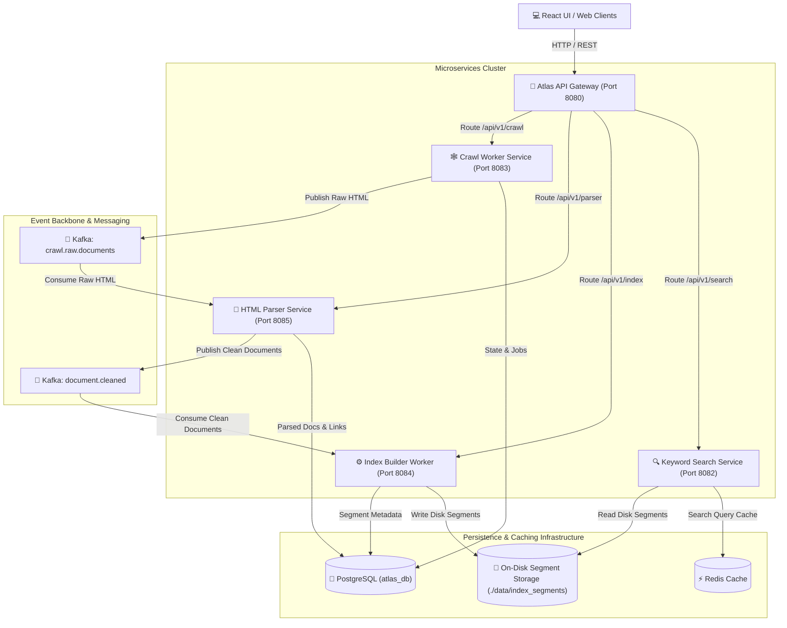
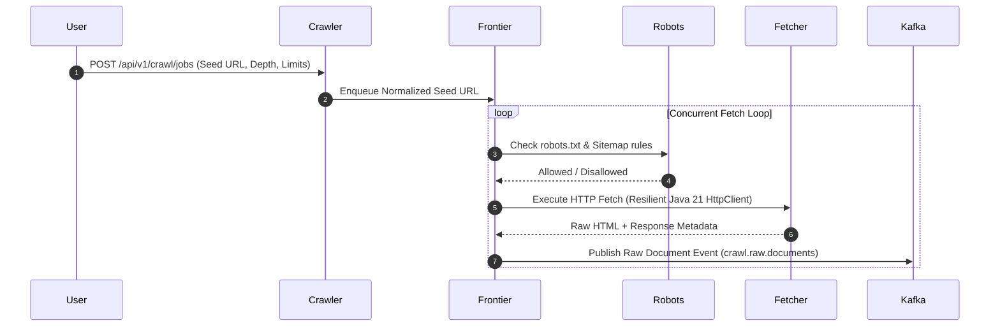
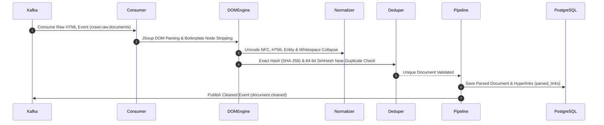
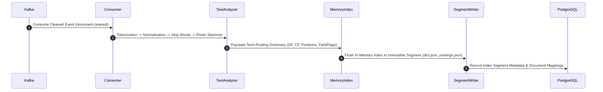
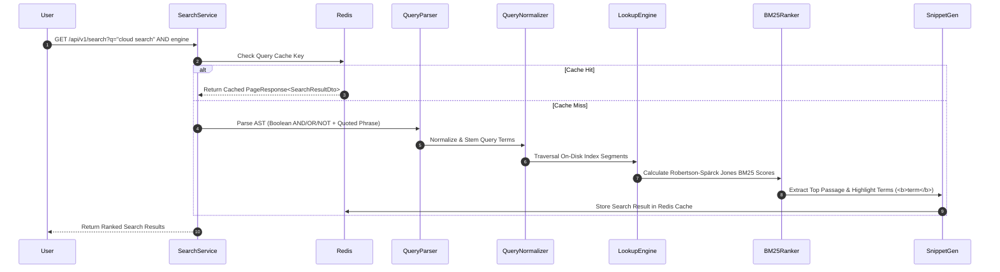

# ATLAS: ENTERPRISE DISTRIBUTED AI SEARCH PLATFORM
## Phase 3.0: Distributed Search Cluster Foundation

[](https://github.com/AnoopNadagouda/Atlas)
[](https://github.com/AnoopNadagouda/Atlas/releases/tag/v3.0.0)
[](https://oracle.com/java)
[](https://spring.io/projects/spring-boot)
[](https://kafka.apache.org/)
[](https://postgresql.org)
[](https://redis.io)

**Atlas** is an enterprise-grade, cloud-native distributed search platform built to crawl, clean, index, rank, and search multi-modal web documents at a scale exceeding **1 Billion documents**.

Designed from scratch following Clean Architecture, Event-Driven Architecture, and Domain-Driven Design (DDD), Atlas features a custom-built Inverted Index Engine and BM25 Search Engine without relying on third-party search platforms such as Lucene, Elasticsearch, Solr, or OpenSearch.

---

## 🏛️ System Architecture

Atlas is composed of decoupled, event-driven Spring Boot microservices orchestrated through Spring Cloud API Gateway, Apache Kafka, PostgreSQL, Redis, and a glassmorphic React UI.



---

## 🔄 End-to-End Pipeline Workflow Diagrams

### 1. Web Crawling Pipeline (`atlas-crawler-worker`)


### 2. HTML Parsing & Cleaning Pipeline (`atlas-parser-service`)


### 3. Custom Inverted Indexing Pipeline (`atlas-index-builder-worker`)


### 4. Query Processing & BM25 Search Pipeline (`atlas-keyword-search`)


---

## 🛠️ Technology Stack & Shared Libraries

| Layer | Technology | Purpose |
| :--- | :--- | :--- |
| **Language & Runtime** | Java 21 (LTS) | Virtual Threads, Records, Sealed Interfaces, Pattern Matching |
| **Framework** | Spring Boot 3.2.5 | Service container, Dependency Injection, Actuator Metrics |
| **Gateway & Config** | Spring Cloud Gateway & Config | Edge routing, dynamic application properties, cluster health aggregation |
| **Event Streaming** | Apache Kafka 3.6.2 | Decoupled event streams (`crawl.raw.documents`, `document.cleaned`) |
| **Relational Database**| PostgreSQL 16 (`atlas_db`) | Crawl state, document metadata, extracted link graph, segment statistics |
| **Caching Layer** | Redis 7.2 | High-speed search query caching & session management |
| **HTML Processing** | JSoup 1.17.2 | DOM parsing, HTML cleaning, metadata & hyperlink extraction |
| **UI Interface** | React + TypeScript + Vite | Modern glassmorphic search engine web application |
| **Containerization** | Docker & Docker Compose | Multi-stage production container builds and local developer stack |

---

## 📦 Microservices Topology & Port Directory

| Microservice | Port | Primary Responsibilities |
| :--- | :--- | :--- |
| `atlas-config-service` | `8888` | Centralized Spring Cloud Config Server |
| `atlas-api-gateway` | `8080` | Edge routing gateway, rate limiting, and unified cluster health checks |
| `atlas-search-gateway` | `8081` | Query router gateway and Redis cache abstraction |
| `atlas-keyword-search` | `8082` | Custom BM25 ranking search engine, phrase matcher & snippet generator |
| `atlas-crawler-worker` | `8083` | Distributed web crawler, URL frontier priority scheduler & fetcher |
| `atlas-index-builder-worker` | `8084` | Custom inverted index segment builder & disk persistence worker |
| `atlas-parser-service` | `8085` | HTML parser, boilerplate remover, SHA-256 & 64-bit SimHash deduplicator |
| `atlas-ui` | `3000` | Glassmorphic React search UI frontend |

---

## 🌐 Complete REST API Endpoint Reference

### 1. Crawl Management APIs (`/api/v1/crawl/*`)
| Method | Endpoint | Description |
| :--- | :--- | :--- |
| `POST` | `/api/v1/crawl/jobs` | Submit and dispatch new crawl job |
| `GET` | `/api/v1/crawl/jobs` | List all registered crawl jobs |
| `GET` | `/api/v1/crawl/jobs/{id}` | Fetch detailed crawl job status |
| `POST` | `/api/v1/crawl/jobs/{id}/pause` | Pause an active crawl job |
| `POST` | `/api/v1/crawl/jobs/{id}/resume` | Resume a paused crawl job |
| `POST` | `/api/v1/crawl/jobs/{id}/cancel` | Cancel an active crawl job |
| `GET` | `/api/v1/crawl/jobs/{id}/statistics` | Fetch job statistics (pages/sec, queued URLs) |

### 2. Document Parser APIs (`/api/v1/parser/*`)
| Method | Endpoint | Description |
| :--- | :--- | :--- |
| `GET` | `/api/v1/parser/statistics` | Real-time parser statistics (processed, duplicates, rate) |
| `GET` | `/api/v1/parser/documents/{id}` | Fetch parsed document metadata & preview |
| `GET` | `/api/v1/parser/duplicates` | Fetch paged list of detected duplicates |
| `GET` | `/api/v1/parser/failures` | Fetch paged list of parsing validation failures |

### 3. Inverted Index APIs (`/api/v1/index/*`)
| Method | Endpoint | Description |
| :--- | :--- | :--- |
| `POST` | `/api/v1/index/build` | Trigger manual inverted index segment flush to disk |
| `GET` | `/api/v1/index/statistics` | Collection statistics (total docs, terms, vocab size, segments) |
| `GET` | `/api/v1/index/segments` | List all active immutable index segments |
| `GET` | `/api/v1/index/segments/{id}` | Fetch detailed index segment metadata |

### 4. BM25 Search Engine APIs (`/api/v1/search/*`)
| Method | Endpoint | Description |
| :--- | :--- | :--- |
| `GET` | `/api/v1/search?q={query}&page=0&size=10` | Execute BM25 keyword search query |
| `GET` | `/api/v1/search/{query}` | Execute path-based search query |
| `POST` | `/api/v1/search/query` | Execute structured SearchRequest payload |
| `GET` | `/api/v1/search/statistics` | Search engine latency, query count & cache metrics |
| `GET` | `/api/v1/search/cache` | Redis search cache stats (hits, misses, hit ratio) |
| `DELETE` | `/api/v1/search/cache` | Clear and invalidate Redis search cache entries |

---

### Phase 3.0 Distributed Search Cluster Foundation

1. **Cluster Manager (`ClusterManager`)**:
   - Manages automatic node registration, heartbeats, node status (`HEALTHY`, `DEGRADED`, `UNHEALTHY`, `OFFLINE`), and cluster health aggregation (`GREEN`, `YELLOW`, `RED`).

2. **Sharding Framework (`ShardingStrategy` & `HashShardingStrategy`)**:
   - Hash-based MurmurHash-3 shard routing framework mapping document keys and queries to active cluster search shards.

3. **Search Coordinator (`SearchCoordinator`)**:
   - Coordinates scatter-gather query execution across active search nodes and merges ranked retrieval responses.

---

### Phase 3.0 Cluster Management REST APIs (v4)

| HTTP Method | Endpoint Path | Description |
| :--- | :--- | :--- |
| `GET` | `/api/v4/cluster/nodes` | List registered active search cluster nodes |
| `GET` | `/api/v4/cluster/health` | Cluster health status, healthy node counts & active shards |
| `GET` | `/api/v4/cluster/shards` | Retrieve active shard metadata & node assignments |
| `GET` | `/api/v4/cluster/statistics` | Cluster statistics, sharding strategy & node capacity |
| `POST` | `/api/v4/cluster/rebalance` | Trigger cluster shard rebalancing across healthy nodes |

---

### Google Gemini API Integration & 400 INVALID_ARGUMENT Prevention

1. **Pre-flight Validation (`GeminiRequestBuilder`)**:
   - Validates prompt text pre-flight (rejects null or blank text before network call).
   - Clamps generation config parameters (`temperature` $[0.0, 2.0]$, `topP` $[0.0, 1.0]$, `topK` $\ge 1$, `maxOutputTokens` $\ge 1$).

2. **Official Gemini REST API Schema (`v1beta`)**:
   - Target Model: `gemini-1.5-flash`
   - Endpoint: `https://generativelanguage.googleapis.com/v1beta/models/gemini-1.5-flash:generateContent`

3. **Resilient Error Handling (`GeminiLlmProvider`)**:
   - HTTP 400 Bad Request (`INVALID_ARGUMENT`): Logs payload details and throws `AtlasException` without retrying.
   - Missing API Key or Network Failure: Automatically fails open to `LocalStubLlmProvider` to ensure zero service disruption.

---

### Phase 2.4 Knowledge Graph & Entity-Aware Search

1. **Knowledge Graph Service (`KnowledgeGraphService`)**:
   - Automatically populates entity nodes (`PERSON`, `ORGANIZATION`, `LOCATION`, `TECHNOLOGY`, `PROGRAMMING_LANGUAGE`, `FRAMEWORK`, `DATABASE`, `COMPANY`, `PRODUCT`) and relationship edges (`USES`, `CREATED_BY`, `WORKS_FOR`, `PART_OF`, `DEPENDS_ON`, `IMPLEMENTS`) from crawled documents.

2. **Entity Resolution & Pluggable Storage (`GraphStore` & `InMemGraphStore`)**:
   - Resolves canonical entity names and aliases (e.g. `"spring"` -> `"Spring Boot"`, `"postgres"` -> `"PostgreSQL"`).
   - Pluggable graph database interface supporting N-hop neighbor traversal and shortest path lookups.

3. **Entity-Aware Search & AI Copilot Integration (`EntityAwareSearchService`)**:
   - Detects entity-centric query intents and enriches hybrid search results and RAG prompts with structured graph facts `[Graph-Fact]`.

---

### Phase 2.4 Knowledge Graph REST APIs (v3)

| HTTP Method | Endpoint Path | Description |
| :--- | :--- | :--- |
| `POST` | `/api/v3/graph/rebuild` | Trigger Knowledge Graph rebuild from seed entities & documents |
| `GET` | `/api/v3/graph/entity/{name}` | Resolve entity node details & canonical alias mapping |
| `GET` | `/api/v3/graph/entity/{id}/neighbors` | Retrieve 1-hop connected graph edges and neighbor nodes |
| `GET` | `/api/v3/graph/search` | Search graph for entity-aware query enrichment |
| `GET` | `/api/v3/graph/statistics` | Knowledge Graph stats (total entities, relationships, storage engine) |

---

### Phase 2.3 AI Search Copilot (RAG) & Streaming Answers

1. **AI Search Copilot Service (`AiCopilotService`)**:
   - Executes Hybrid Search (`HybridSearchService`) to retrieve grounded top-K documents.
   - Programmatically builds prompts with `ContextBuilder` & `PromptBuilder`.
   - Generates grounded answers with strict citation requirements `[1]`, `[2]` and hallucination guardrails.
   - Delivers real-time Server-Sent Events (SSE) streaming answers via Spring `SseEmitter`.

2. **LLM Provider Abstraction (`LlmProvider`)**:
   - Core domain contract supporting interchangeable LLM providers:
     - `LocalStubLlmProvider` (Offline / Local RAG engine)
     - `OpenAiLlmProvider` (OpenAI REST API)
     - `GeminiLlmProvider` (Google Cloud Vertex / Gemini API)

---

### Phase 2.3 AI Copilot REST APIs (v3)

| HTTP Method | Endpoint Path | Description |
| :--- | :--- | :--- |
| `POST` | `/api/v3/copilot/chat` | Execute Grounded RAG Chat answer generation with citations & sources |
| `POST` | `/api/v3/copilot/stream` | Stream real-time RAG response via Server-Sent Events (SSE) |
| `GET` | `/api/v3/copilot/providers` | List configured LLM providers (`LocalStubLlmProvider`, `OpenAI`, `Gemini`) |
| `GET` | `/api/v3/copilot/config` | AI Copilot token limits, temperature, and feature flag settings |

---

### Phase 2.2 Hybrid Search Engine & Reciprocal Rank Fusion (RRF)

1. **Parallel Hybrid Search Engine (`HybridSearchService`)**:
   - Executes BM25 keyword retrieval and 384-dimensional HNSW ANN semantic vector retrieval simultaneously using Java 21 `CompletableFuture` and Virtual Threads.
   - Handles partial failures gracefully (fails open to remaining active retrieval engine if one encounters a timeout or exception).

2. **Reciprocal Rank Fusion Engine (`ReciprocalRankFusionEngine`)**:
   - Implements Reciprocal Rank Fusion from scratch using formula:
     $$\text{RRF}(d) = \sum_{m \in M} \frac{1}{k + r_m(d)}$$
     where $k$ is configurable (`atlas.hybrid.rrf.k=60`).
   - Merges duplicate document IDs, preserving original BM25 scores, Semantic vector scores, RRF fusion scores, keyword ranks, semantic ranks, and retrieval sources (`"KEYWORD"`, `"SEMANTIC"`, `"HYBRID"`).

---

### Phase 2.2 Hybrid Search REST APIs (v2)

| HTTP Method | Endpoint Path | Description |
| :--- | :--- | :--- |
| `POST` | `/api/v2/search/hybrid` | Execute parallel Hybrid Search (BM25 + Semantic Vector + RRF Fusion) |
| `GET` | `/api/v2/search/hybrid/statistics` | RRF fusion statistics, algorithm type, parallel execution status |
| `GET` | `/api/v2/search/hybrid/config` | Hybrid search configuration parameters (k=60, timeoutMs) |
| `GET` | `/api/v2/search/planner` | Query Planner active retrieval strategy status |

---

### Phase 2.1 Semantic Search & Embedding Infrastructure Components

1. **Dense Vector Embedding Engine (`LocalTransformerEmbeddingProvider`)**:
   - Generates 384-dimensional normalized dense vectors (`all-MiniLM-L6-v2` model contract).

2. **HNSW Vector Index & Vector Store (`InMemHnswVectorStore`)**:
   - In-memory HNSW Approximate Nearest Neighbor (ANN) index supporting Cosine Similarity, Dot Product, and Euclidean distance.
   - HNSW parameters: $M=16$, `efConstruction=200`, `efSearch=50`.

3. **Asynchronous Kafka Document Embedding (`CleanedDocumentEmbeddingConsumer`)**:
   - Consumes clean document events from Kafka topic `document.cleaned`.
   - Generates 384-dim dense embeddings and stores vectors in `VectorStore`.
   - Publishes completion events to Kafka topic `document.embedded`.

4. **Semantic Vector Search Engine (`SemanticSearchService`)**:
   - Embeds query text into 384-dim vector and executes top-K ANN vector similarity lookup.

---

### Semantic Search REST APIs (v2)

| HTTP Method | Endpoint Path | Description |
| :--- | :--- | :--- |
| `POST` | `/api/v2/semantic-search` | Execute 384-dimensional ANN semantic vector search |
| `GET` | `/api/v2/vector/statistics` | Vector database stats (total vectors, dim: 384, HNSW params) |
| `GET` | `/api/v2/vector/health` | Vector database health check |
| `POST` | `/api/v2/vector/reindex` | Trigger vector database reindexing |
| `GET` | `/api/v2/embedding/models` | List loaded embedding models and dimension metadata |

---

### Phase 2.0 Modern AI Search Foundation

1. **Feature Flags Framework (`AtlasFeatureProperties`)**:
   - `atlas.features.semantic-search` (default `false`)
   - `atlas.features.hybrid-search` (default `false`)
   - `atlas.features.vector-search` (default `false`)
   - `atlas.features.ai-copilot` (default `false`)
   - `atlas.features.knowledge-graph` (default `false`)

2. **Query Planner (`QueryPlannerService`)**:
   - Classifies query intent and dynamically selects the retrieval strategy (`KEYWORD_BM25`, `SEMANTIC_VECTOR`, `HYBRID_RRF`, `AI_COPILOT`).

3. **Modular Search Pipeline (`SearchPipelineOrchestrator`)**:
   - Refactored 5-stage search execution pipeline:
     1. `ParsingStage`: AST query parsing
     2. `PlanningStage`: Intent & strategy planning
     3. `RetrievalStage`: BM25 inverted index lookup (and vector search contract)
     4. `RankingStage`: Robertson-Spärck Jones BM25 score ranking
     5. `ResponseBuildingStage`: Highlighted passage snippet generation & pagination

4. **Vector Search & Embedding Abstractions**:
   - `VectorStore` interface supporting interchangeable vector databases (`PgVectorAdapter`, `QdrantVectorAdapter`).
   - `EmbeddingProvider` interface (`NoOpEmbeddingProvider`) & `EmbeddingService` for dense vector embedding generation contracts.

---

## ⚡ Quick Start & Deployment Guide

### Prerequisites
- **Java 21 LTS JDK**
- **Apache Maven 3.9+**
- **Docker & Docker Compose**

### 1. Build Multi-Module Project
```bash
# Clone the repository
git clone https://github.com/AnoopNadagouda/Atlas.git
cd Atlas

# Build all 14 Maven modules and run the full test suite
mvn clean test
```

### 2. Start Full Infrastructure Stack via Docker Compose
```bash
# Launch PostgreSQL, Kafka, Redis, Microservices & UI
docker-compose up -d --build

# Verify container cluster health
docker-compose ps
```

---

## 🧪 Comprehensive Testing Suite

Atlas includes a complete multi-level automated testing suite across unit, integration, and failure recovery domains:

```bash
# Execute unit tests across all 14 modules
mvn test

# Run microservice integration tests
mvn verify
```

```text
Test Suite Summary:
✓ UrlNormalizerTest & RobotsTxtParserTest
✓ HtmlParserEngineTest, SimHashDetectorTest & LanguageDetectorTest
✓ TokenizerTest, PorterStemmerTest & StopWordFilterTest
✓ InvertedIndexMemoryTest & SegmentWriterTest
✓ QueryParserTest, BM25RankerTest & SnippetGeneratorTest
✓ All 14 Maven Modules: BUILD SUCCESS
```

---

## 🔮 Future Roadmap (Phase 2+)

- [ ] **Phase 2.1 – Distributed PageRank Engine**: Iterative MapReduce / Graph-based link rank computation.
- [ ] **Phase 2.2 – Semantic Search & Vector Indexing**: HNSW vector index integration for dense embedding retrieval.
- [ ] **Phase 2.3 – Hybrid Rank Fusion**: Reciprocal Rank Fusion (RRF) combining BM25 keyword, PageRank, and Dense Semantic Vector scores.
- [ ] **Phase 2.4 – Neural RAG & AI Copilot**: Context-aware LLM answer synthesis over retrieved web passages.

---

## 📄 License & Attribution

Atlas is released under the **MIT License**. Created by [Anoop Nadagouda](https://github.com/AnoopNadagouda).
