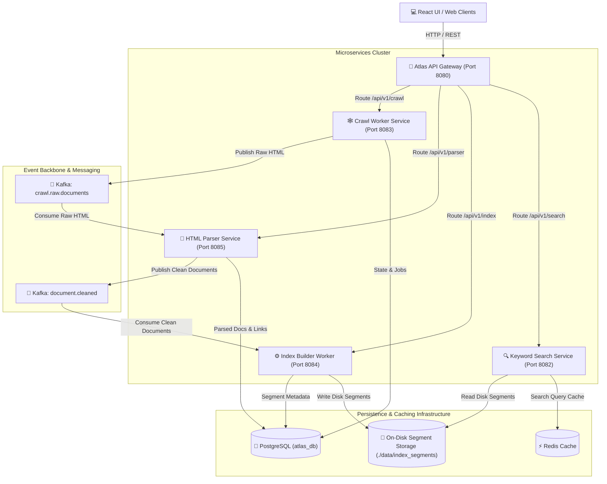
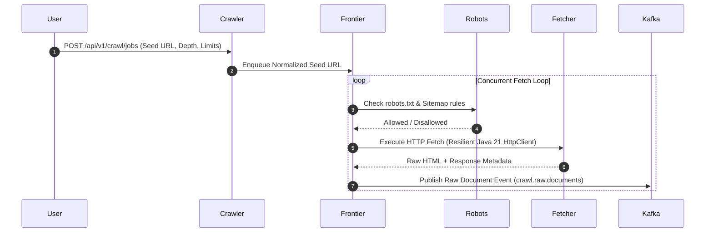
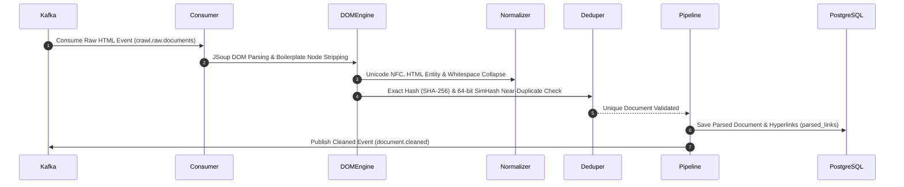
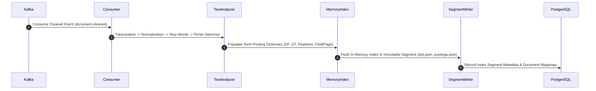
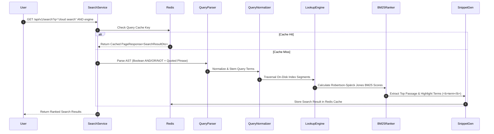

# ATLAS: ENTERPRISE DISTRIBUTED AI SEARCH PLATFORM
## Phase 1 Production Release (v1.0.0) — Distributed Keyword Search Engine

[](https://github.com/AnoopNadagouda/Atlas)
[](https://github.com/AnoopNadagouda/Atlas/releases/tag/v1.0.0)
[](https://oracle.com/java)
[](https://spring.io/projects/spring-boot)
[](https://kafka.apache.org/)
[](https://postgresql.org)
[](https://redis.io)

**Atlas** is an enterprise-grade, cloud-native distributed search platform built to crawl, clean, index, rank, and search multi-modal web documents at a scale exceeding **1 Billion documents**.

Designed from scratch following Clean Architecture, Event-Driven Architecture, and Domain-Driven Design (DDD), Atlas features a custom-built Inverted Index Engine and BM25 Search Engine without relying on third-party search platforms such as Lucene, Elasticsearch, Solr, or OpenSearch.

---

## 🏛️ System Architecture

Atlas is composed of decoupled, event-driven Spring Boot microservices orchestrated through Spring Cloud API Gateway, Apache Kafka, PostgreSQL, Redis, and a glassmorphic React UI.



---

## 🔄 End-to-End Pipeline Workflow Diagrams

### 1. Web Crawling Pipeline (`atlas-crawler-worker`)


### 2. HTML Parsing & Cleaning Pipeline (`atlas-parser-service`)


### 3. Custom Inverted Indexing Pipeline (`atlas-index-builder-worker`)


### 4. Query Processing & BM25 Search Pipeline (`atlas-keyword-search`)


---

## 🛠️ Technology Stack & Shared Libraries

| Layer | Technology | Purpose |
| :--- | :--- | :--- |
| **Language & Runtime** | Java 21 (LTS) | Virtual Threads, Records, Sealed Interfaces, Pattern Matching |
| **Framework** | Spring Boot 3.2.5 | Service container, Dependency Injection, Actuator Metrics |
| **Gateway & Config** | Spring Cloud Gateway & Config | Edge routing, dynamic application properties, cluster health aggregation |
| **Event Streaming** | Apache Kafka 3.6.2 | Decoupled event streams (`crawl.raw.documents`, `document.cleaned`) |
| **Relational Database**| PostgreSQL 16 (`atlas_db`) | Crawl state, document metadata, extracted link graph, segment statistics |
| **Caching Layer** | Redis 7.2 | High-speed search query caching & session management |
| **HTML Processing** | JSoup 1.17.2 | DOM parsing, HTML cleaning, metadata & hyperlink extraction |
| **UI Interface** | React + TypeScript + Vite | Modern glassmorphic search engine web application |
| **Containerization** | Docker & Docker Compose | Multi-stage production container builds and local developer stack |

---

## 📦 Microservices Topology & Port Directory

| Microservice | Port | Primary Responsibilities |
| :--- | :--- | :--- |
| `atlas-config-service` | `8888` | Centralized Spring Cloud Config Server |
| `atlas-api-gateway` | `8080` | Edge routing gateway, rate limiting, and unified cluster health checks |
| `atlas-search-gateway` | `8081` | Query router gateway and Redis cache abstraction |
| `atlas-keyword-search` | `8082` | Custom BM25 ranking search engine, phrase matcher & snippet generator |
| `atlas-crawler-worker` | `8083` | Distributed web crawler, URL frontier priority scheduler & fetcher |
| `atlas-index-builder-worker` | `8084` | Custom inverted index segment builder & disk persistence worker |
| `atlas-parser-service` | `8085` | HTML parser, boilerplate remover, SHA-256 & 64-bit SimHash deduplicator |
| `atlas-ui` | `3000` | Glassmorphic React search UI frontend |

---

## 🌐 Complete REST API Endpoint Reference

### 1. Crawl Management APIs (`/api/v1/crawl/*`)
| Method | Endpoint | Description |
| :--- | :--- | :--- |
| `POST` | `/api/v1/crawl/jobs` | Submit and dispatch new crawl job |
| `GET` | `/api/v1/crawl/jobs` | List all registered crawl jobs |
| `GET` | `/api/v1/crawl/jobs/{id}` | Fetch detailed crawl job status |
| `POST` | `/api/v1/crawl/jobs/{id}/pause` | Pause an active crawl job |
| `POST` | `/api/v1/crawl/jobs/{id}/resume` | Resume a paused crawl job |
| `POST` | `/api/v1/crawl/jobs/{id}/cancel` | Cancel an active crawl job |
| `GET` | `/api/v1/crawl/jobs/{id}/statistics` | Fetch job statistics (pages/sec, queued URLs) |

### 2. Document Parser APIs (`/api/v1/parser/*`)
| Method | Endpoint | Description |
| :--- | :--- | :--- |
| `GET` | `/api/v1/parser/statistics` | Real-time parser statistics (processed, duplicates, rate) |
| `GET` | `/api/v1/parser/documents/{id}` | Fetch parsed document metadata & preview |
| `GET` | `/api/v1/parser/duplicates` | Fetch paged list of detected duplicates |
| `GET` | `/api/v1/parser/failures` | Fetch paged list of parsing validation failures |

### 3. Inverted Index APIs (`/api/v1/index/*`)
| Method | Endpoint | Description |
| :--- | :--- | :--- |
| `POST` | `/api/v1/index/build` | Trigger manual inverted index segment flush to disk |
| `GET` | `/api/v1/index/statistics` | Collection statistics (total docs, terms, vocab size, segments) |
| `GET` | `/api/v1/index/segments` | List all active immutable index segments |
| `GET` | `/api/v1/index/segments/{id}` | Fetch detailed index segment metadata |

### 4. BM25 Search Engine APIs (`/api/v1/search/*`)
| Method | Endpoint | Description |
| :--- | :--- | :--- |
| `GET` | `/api/v1/search?q={query}&page=0&size=10` | Execute BM25 keyword search query |
| `GET` | `/api/v1/search/{query}` | Execute path-based search query |
| `POST` | `/api/v1/search/query` | Execute structured SearchRequest payload |
| `GET` | `/api/v1/search/statistics` | Search engine latency, query count & cache metrics |
| `GET` | `/api/v1/search/cache` | Redis search cache stats (hits, misses, hit ratio) |
| `DELETE` | `/api/v1/search/cache` | Clear and invalidate Redis search cache entries |

---

## ⚡ Quick Start & Deployment Guide

### Prerequisites
- **Java 21 LTS JDK**
- **Apache Maven 3.9+**
- **Docker & Docker Compose**

### 1. Build Multi-Module Project
```bash
# Clone the repository
git clone https://github.com/AnoopNadagouda/Atlas.git
cd Atlas

# Build all 14 Maven modules and run the full test suite
mvn clean test
```

### 2. Start Full Infrastructure Stack via Docker Compose
```bash
# Launch PostgreSQL, Kafka, Redis, Microservices & UI
docker-compose up -d --build

# Verify container cluster health
docker-compose ps
```

---

## 🧪 Comprehensive Testing Suite

Atlas includes a complete multi-level automated testing suite across unit, integration, and failure recovery domains:

```bash
# Execute unit tests across all 14 modules
mvn test

# Run microservice integration tests
mvn verify
```

```text
Test Suite Summary:
✓ UrlNormalizerTest & RobotsTxtParserTest
✓ HtmlParserEngineTest, SimHashDetectorTest & LanguageDetectorTest
✓ TokenizerTest, PorterStemmerTest & StopWordFilterTest
✓ InvertedIndexMemoryTest & SegmentWriterTest
✓ QueryParserTest, BM25RankerTest & SnippetGeneratorTest
✓ All 14 Maven Modules: BUILD SUCCESS
```

---

## 🔮 Future Roadmap (Phase 2+)

- [ ] **Phase 2.1 – Distributed PageRank Engine**: Iterative MapReduce / Graph-based link rank computation.
- [ ] **Phase 2.2 – Semantic Search & Vector Indexing**: HNSW vector index integration for dense embedding retrieval.
- [ ] **Phase 2.3 – Hybrid Rank Fusion**: Reciprocal Rank Fusion (RRF) combining BM25 keyword, PageRank, and Dense Semantic Vector scores.
- [ ] **Phase 2.4 – Neural RAG & AI Copilot**: Context-aware LLM answer synthesis over retrieved web passages.

---

## 📄 License & Attribution

Atlas is released under the **MIT License**. Created by [Anoop Nadagouda](https://github.com/AnoopNadagouda).
